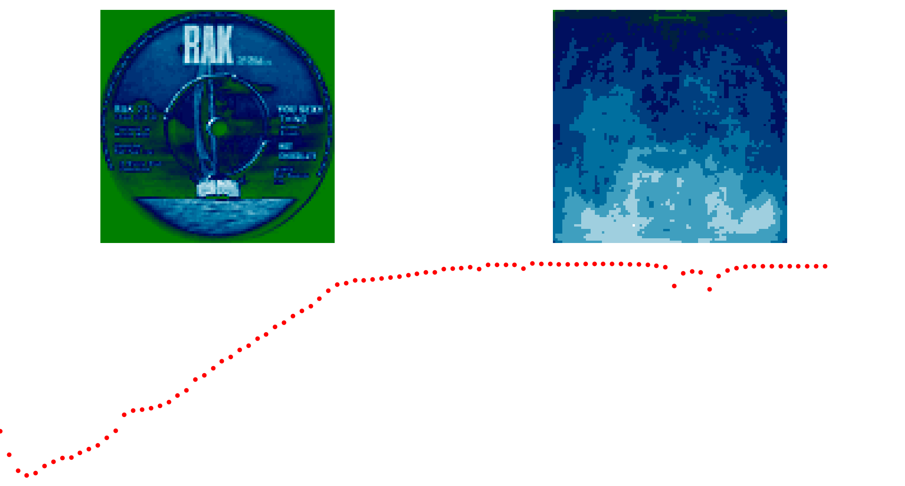
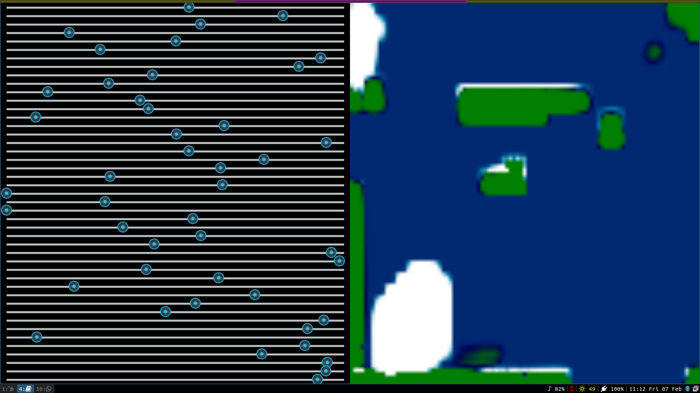

# Covert Art Generation

Using a Covert Dataset i found on Kaggle, to understand Image Generation.

- [ ] Dense Autoencoders
- [ ] Convolutional Autoencoders
- [ ] Variational Autoencoders


# Getting Started

```bash

$ pip install -r requirement.txt
$ python kivy_test.py

```


## Convolutional Autoencoder

Attempting to Create a

- Trained convolutional autoencoder for 2140 Epochs, Took 16 hrs on CUDA MX150 GPU.
- Results arent too good.

- Probably Requires more channels, as it seem model dont have enough capacity to learn all features, especially for such a complex dataset.






# Roadmap

- [x] Dashboard for Visually Evaluting Traing Process
- [x] Interactive App
- [ ] Interactive Web App


# References

- https://matplotlib.org/1.5.3/users/style_sheets.html


# Resources

- [Dataset Link Kaggle]()
- [Great Course NPTEL: DLCV]()
- [Code Parade Video Face Generation]()